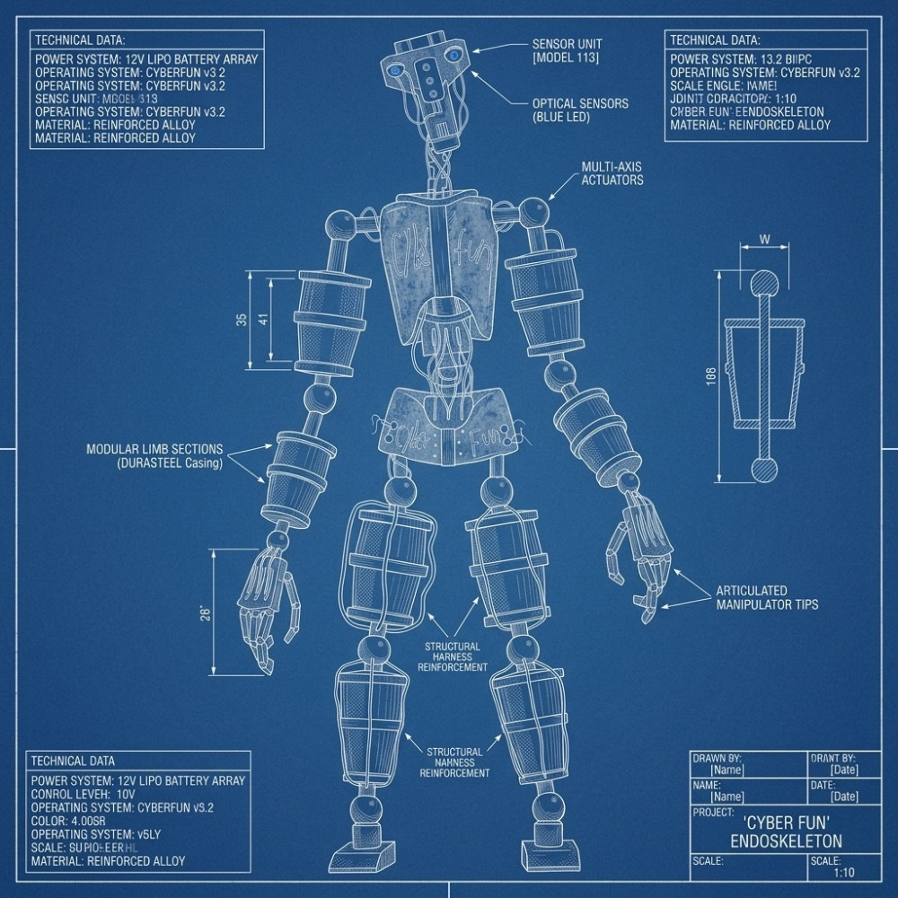

# Cyber Fun Endoskeleton v3.1.0

[](https://github.com/V0rtexLinux/cyberfun_tech_v3)
[](https://www.python.org/)
[](LICENSE)
[](https://www.raspberrypi.org/)
[](https://www.arduino.cc/)

Professional animatronic control system for Raspberry Pi 4, with support for two characters (Fredbear and Springbonnie) and a shared modular architecture.

<p align="center">
  
  <br>
  <em>Endoskeleton Technical Blueprint</em>
</p>

<p align="center">
  
  <br>
  <em>Expected Final Result</em>
</p>

## Features

### Advanced Facial Expression
- **7 movement axes:** jaw, eyelids (2), eyes X/Y, ears (2)
- **12 emotion presets:** happy, excited, surprised, sad, angry, wink, blink, talking, singing, laughing, sleepy
- **Movement smoothing:** easing functions (linear, ease_in_out, bounce, elastic)
- **Automatic lip-sync:** lip synchronization via real-time audio analysis
- **Auto-blink:** random interval 2-6 seconds

### Artificial Intelligence
- **Multi-backend:** GPT-4o (OpenAI) → Ollama (local) → Fallback (offline)
- **Configurable personality:** 6 modes (friendly, excited, creepy, storyteller, dj, guardian)
- **Emotion detection:** sentiment analysis in responses
- **Persistent context:** conversation history
- **Adaptive voice:** automatic TTS selection based on emotion

### Computer Vision
- **Face detection:** Haar Cascade or DNN
- **Multi-face tracking:** persistent IDs with temporal smoothing
- **Gaze tracking:** converting face position to eye angles
- **Basic SLAM:** 2D mapping with occupancy grid

### Autonomous Locomotion
- **A* Pathfinding:** path planning with Euclidean heuristic
- **Obstacle avoidance:** potential fields for deviation
- **Differential control:** kinematics for differential drive
- **SLAM:** Simultaneous Localization and Mapping

### Hardware & Safety
- **Binary serial protocol:** efficient and robust
- **Abstract HAL:** supports simulation without hardware
- **5s Watchdog:** automatic safety reset
- **FSM (Finite State Machine):** validated states, prevents conflicting actions
- **E-Stop:** emergency stop via hardware and software

## Installation

### Requirements

- Raspberry Pi 4 (4GB RAM recommended)
- Raspberry Pi OS 64-bit (Bookworm)
- Arduino Mega 2560
- Python 3.9+

### Dependencies

```bash
# System
sudo apt update
sudo apt install -y python3-pip python3-venv espeak-ng libespeak-ng-dev
sudo apt install -y python3-pyaudio portaudio19-dev
sudo apt install -y mpg123 alsa-utils
sudo apt install -y libatlas-base-dev libhdf5-dev
sudo apt install -y libopencv-dev python3-opencv

# Enable interfaces
sudo raspi-config
# Interface Options → Serial Port → Yes (disable login, enable serial)
# Interface Options → I2C → Yes
# Interface Options → Camera → Yes
```

### Project Installation

```bash
# Clone repository
cd ~/
git clone https://github.com/V0rtexLinux/cyberfun_tech_v3.git
cd cyberfun_tech_v3

# Create virtual environment
python3 -m venv venv
source venv/bin/activate

# Install dependencies
pip install -r requirements.txt

# Install core package in development mode
pip install -e .
```

### Python Dependencies (requirements.txt)

| Category | Packages | Version |
|----------|----------|---------|
| **Core** | numpy, scipy, pyyaml | >=1.24.0, >=1.11.0, >=6.0.1 |
| **Serial/Arduino** | pyserial | >=3.5 |
| **Audio** | pygame, pyaudio, soundfile, librosa | >=2.5.0, >=0.2.14, >=0.12.0, >=0.10.0 |
| **TTS** | pyttsx3, gTTS | >=2.90, >=2.5.0 |
| **AI/Chatbot** | openai, requests | >=1.40.0, >=2.31.0 |
| **Vision** | opencv-python, tflite-runtime | >=4.8.0, >=2.14.0 |
| **WebSocket** | websockets, aiohttp | >=12.0, >=3.9.0 |
| **GPIO/Raspberry Pi** | RPi.GPIO, smbus2 | >=0.7.1, >=0.4.3 |
| **Utilities** | python-dotenv, colorlog, psutil, schedule | >=1.0.0, >=6.8.0, >=5.9.0, >=1.2.0 |
| **Development** | pytest, pytest-cov, black, flake8, mypy | >=7.4.0, >=4.1.0, >=23.0.0, >=6.0.0, >=1.0.0 |

## Usage

### Run Fredbear

```bash
cd Fredbear
python3 -m Fredbear_system.main --config ../config/fredbear.yaml
```

### Run Springbonnie

```bash
cd Springbonnie
python3 -m Springbonnie_system.main --config ../config/springbonnie.yaml
```

### Simulation Mode (no hardware)

```bash
# Full simulation mode
python3 animatronic_simulator.py --debug

# Simulation with detailed logging
python3 animatronic_simulator.py --debug --verbose

# Use console entry point (after pip install -e .)
cyberfun-simulator --debug
```

### Command Line Arguments

| Argument | Description | Default |
|----------|-------------|---------|
| `--config` | Path to YAML configuration file | `../config/fredbear.yaml` |
| `--debug` | Enable debug mode with verbose logging | `false` |
| `--simulate` | Force simulation mode (no hardware) | `false` |
| `--port` | Arduino serial port | `/dev/ttyACM0` |
| `--no-vision` | Disable computer vision | `false` |
| `--no-locomotion` | Disable locomotion | `false` |
| `--personality` | Personality mode | `friendly` |

### Tests

```bash
# All tests
pytest tests/ -v

# With coverage
pytest tests/ --cov=core --cov-report=html

# Specific
pytest tests/test_hardware.py -v
```

## Hardware Specifications

### Required Components

| Component | Specification | Interface | Function |
|-----------|---------------|-----------|----------|
| **SBC** | Raspberry Pi 4 (4GB+ RAM) | - | Main processing |
| **Microcontroller** | Arduino Mega 2560 | USB Serial | Low-level control |
| **Servos** | 7x MG996R / DS3218 | PWM 50Hz | Facial expression |
| **DC Motors** | 2x 12V with encoder | PWM + GPIO | Differential locomotion |
| **PIR Sensor** | HC-SR501 | GPIO | Presence detection |
| **Ultrasonic** | HC-SR04 | GPIO | Obstacle detection |
| **IMU** | MPU-6050 | I2C | Orientation and stability |
| **Camera** | Raspberry Pi Camera v2 | CSI | Computer vision |
| **Microphone** | USB or PSRAM | USB | Audio/voice input |
| **LEDs** | 2x RGB 5050 | GPIO/PWM | Eye lighting |

### Servo Configuration (Fredbear)

| ID | Name | Min Angle | Max Angle | Neutral Pulse | Max Speed |
|----|------|-----------|-----------|---------------|-----------|
| 0 | Jaw | 0° | 45° | 1500µs | 120°/s |
| 1 | Left Eyelid | 0% | 100% | 2500µs | 400°/s |
| 2 | Right Eyelid | 0% | 100% | 2500µs | 400°/s |
| 3 | Eye X | -45° | +45° | 1500µs | 180°/s |
| 4 | Eye Y | -30° | +30° | 1500µs | 180°/s |
| 5 | Left Ear | -20° | +20° | 1500µs | 90°/s |
| 6 | Right Ear | -20° | +20° | 1500µs | 90°/s |

### Motor Configuration

| ID | Name | PWM Pin | Dir Pins | Encoder Pins | Max Speed |
|----|------|---------|----------|--------------|-----------|
| left | LeftDrive | 10 | [11, 12] | [20, 21] | 255 |
| right | RightDrive | 13 | [14, 15] | [22, 23] | 255 |

### Estimated Power Consumption

| Mode | Power | Details |
|------|-------|---------|
| **Idle** | ~5W | Raspberry Pi idle |
| **Normal Operation** | ~15W | Active servos, normal processing |
| **Peak** | ~25W | Moving motors, all servos active |

### Serial Protocol (Arduino)

**Format:** `0xAA [CMD] [DATA...] 0x55`

| Command | Code | Description |
|---------|------|-------------|
| `CMD_SERVO` | 0x01 | Set servo pulse |
| `CMD_MOTOR` | 0x02 | Set motor speed |
| `CMD_LED` | 0x03 | Set LED RGB |
| `CMD_MULTIPLE_SERVOS` | 0x04 | Set multiple servos |
| `CMD_STOP_ALL` | 0x05 | Stop all motors |
| `CMD_ESTOP` | 0xFE | Emergency stop |
| `CMD_HEARTBEAT` | 0xFF | Watchdog heartbeat |

---

## Project Structure

```
cyberfun_tech_v3/
├── core/                           # Shared code
│   ├── __init__.py                 # Main exports
│   ├── config/                     # YAML configuration system
│   │   ├── __init__.py
│   │   └── loader.py               # Config loader and validator
│   ├── hal/                        # Hardware Abstraction Layer
│   │   ├── __init__.py
│   │   └── hardware_controller.py  # Arduino interface
│   ├── expression/                 # Facial expression control
│   │   ├── __init__.py
│   │   └── facial_controller.py    # 7 axes + 12 emotions
│   ├── ai/                         # Artificial intelligence
│   │   ├── __init__.py
│   │   └── ai_brain.py             # GPT-4o / Ollama / Fallback
│   ├── vision/                     # Computer vision
│   │   ├── __init__.py
│   │   └── face_tracker.py         # Face detection and tracking
│   ├── locomotion/                 # Autonomous navigation
│   │   ├── __init__.py
│   │   └── advanced_locomotion.py  # SLAM + A* pathfinding
│   └── kernel/                     # Kernel and FSM
│       ├── __init__.py
│       └── fsm_kernel.py           # Finite State Machine
│
├── config/                         # YAML configuration files
│   ├── fredbear.yaml               # Fredbear configuration
│   └── springbonnie.yaml           # Springbonnie configuration
│
├── Fredbear/                       # Fredbear application
│   └── Fredbear_system/
│       ├── __init__.py
│       ├── main.py                 # Main entry point
│       ├── ai/                     # Specific AI
│       ├── arduino/                # Arduino code
│       ├── audio/                  # Audio shows
│       ├── config/                 # Local configurations
│       ├── expression/             # Facial animations
│       ├── hal/                    # Hardware interface
│       ├── kernel/                 # Orchestration
│       ├── locomotion/             # Navigation
│       ├── network/                # WebSocket server
│       ├── sensors/                # Sensors
│       ├── sequences/              # Sequential animations
│       ├── tts/                    # Text-to-speech
│       ├── utils/                  # Utilities
│       └── vision/                 # Vision
│
├── Springbonnie/                   # Springbonnie application
│   └── Springbonnie_system/        # Same structure as Fredbear
│       ├── __init__.py
│       ├── main.py
│       └── [same subfolders]
│
├── tests/                          # pytest test suite
│   ├── __init__.py
│   ├── conftest.py                 # Shared fixtures
│   ├── test_config.py              # Configuration tests
│   ├── test_hardware.py            # Hardware/serial tests
│   ├── test_expression.py          # Facial expression tests
│   ├── test_ai.py                  # AI tests
│   └── test_integration.py         # Integration tests
│
├── docs/                           # Technical documentation
│   ├── ARCHITECTURE.md             # Detailed architecture
│   └── API.md                      # API reference
│
├── images/                         # Project images
│   ├── blueprint.jpg               # Technical blueprint
│   └── expected final result.jpg   # Render result
│
├── simulator_logs/                 # Simulator logs
├── animatronic_simulator.py        # Dual simulator (Fredbear + Springbonnie)
├── SIMULATOR_README.md             # Simulator documentation
├── setup.py                        # Installation script
├── requirements.txt                # Python dependencies
├── fredbear.service                # Fredbear systemd service
├── springbonnie.service            # Springbonnie systemd service
├── install.sh                      # Automated installation script
└── README.md                       # This file
```

## Complete Configuration

YAML configuration files in `config/` control all aspects of the system:

### YAML Structure

```yaml
# ================================================================================
# CYBER FUN ENDOSKELETON - Configuration v3.1.0
# ================================================================================

name: "Fredbear"
version: "3.1.0"

# ================================================================================
# HARDWARE - Servo Configuration
# ================================================================================
hardware:
  servos:
    - id: 0
      name: "Jaw"
      min_angle: 0.0
      max_angle: 45.0
      min_pulse: 500
      max_pulse: 2500
      neutral_pulse: 1500
      max_speed: 120.0
      inverted: false
    # ... (6 additional servos)

# ================================================================================
# MOTORS - Locomotion
# ================================================================================
motors:
  - id: "left"
    name: "LeftDrive"
    pwm_pin: 10
    dir_pins: [11, 12]
    max_speed: 255
    encoder_pins: [20, 21]
  - id: "right"
    name: "RightDrive"
    pwm_pin: 13
    dir_pins: [14, 15]
    max_speed: 255
    encoder_pins: [22, 23]

# ================================================================================
# SENSORS
# ================================================================================
sensors:
  pir_pin: 17                    # Presence sensor
  ultrasonic_trigger: 23         # HC-SR04 trigger
  ultrasonic_echo: 24            # HC-SR04 echo
  imu_i2c_addr: 0x68             # MPU-6050
  mic_device: 0                  # Microphone index
  temperature_sensor: 4          # DS18B20 pin (OneWire)

# ================================================================================
# ARTIFICIAL INTELLIGENCE
# ================================================================================
ai:
  backend_priority: ["openai", "ollama", "fallback"]
  openai_model: "gpt-4o-mini"
  ollama_model: "llama3.2:3b"
  ollama_host: "http://localhost:11434"
  max_tokens: 100
  temperature: 0.8
  conversation_history_size: 10

# ================================================================================
# COMPUTER VISION
# ================================================================================
vision:
  enabled: true
  camera_index: 0
  resolution: [640, 480]
  fps: 30
  face_detection_model: "haarcascade_frontalface_default.xml"
  tflite_model_path: null
  detection_threshold: 0.5
  track_faces: true
  max_tracking_distance: 100
  enable_gaze_tracking: true
  enable_emotion_detection: false

# ================================================================================
# NETWORK AND COMMUNICATION
# ================================================================================
network:
  websocket_port: 8765
  web_interface_port: 8080
  enable_remote_control: true
  max_clients: 5
  enable_discovery: true
  discovery_port: 5000

# ================================================================================
# CHARACTER PERSONALITY
# ================================================================================
personality:
  name: "Fredbear"
  character_type: "golden_bear"
  default_voice: "robot_male"
  available_modes: ["friendly", "excited", "creepy", "storyteller", "dj", "guardian"]
  system_prompt: |
    You are Fredbear, the main animatronic of Cyber Fun Pizzeria...
  greetings:
    - "Hello hello! Welcome to the best pizzeria in the universe!"
    - "Hey you! Yes, you! Welcome!"
  jokes:
    - "Why did the robot go to the doctor? Because it had a virus! HA HA HA!"
  night_phrases:
    - "Good night... did you know that cameras never sleep?"

# ================================================================================
# ADVANCED LOCOMOTION
# ================================================================================
locomotion:
  enabled: true
  wheel_base: 0.3               # Distance between wheels (meters)
  wheel_diameter: 0.08          # Wheel diameter (meters)
  max_linear_speed: 0.5         # m/s
  max_angular_speed: 1.0        # rad/s
  enable_slam: true             # Simultaneous Localization and Mapping
  enable_pathfinding: true      # A* pathfinding
  obstacle_detection_range: 1.0 # meters
  safety_stop_distance: 0.2     # meters
  map_resolution: 0.05          # meters/cell
  map_size: [10, 10]            # meters x meters
  enable_auto_docking: false

# ================================================================================
# LOGGING
# ================================================================================
logging:
  level: "INFO"                 # DEBUG, INFO, WARNING, ERROR
  to_file: true
  directory: "logs"
  max_file_size: 10485760       # 10MB
  backup_count: 5

# ================================================================================
# DEBUG AND SIMULATION
# ================================================================================
debug:
  enabled: false
  simulate_hardware: false
  verbose_serial: false
  profile_performance: false
```

### Available Personality Modes

| Mode | Description | Recommended Use |
|------|-------------|-----------------|
| `friendly` | Normal, friendly | Default operation |
| `excited` | Excited, party mode | Special events |
| `creepy` | Scary, night mode | Halloween, night mode |
| `storyteller` | Storyteller | Narration, entertainment |
| `dj` | Musical, rhythmic | Shows, music |
| `guardian` | Protector, serious | Security, surveillance |

### Emotion Presets

```python
class EmotionPreset(Enum):
    NEUTRAL = "neutral"
    HAPPY = "happy"
    EXCITED = "excited"
    SURPRISED = "surprised"
    SAD = "sad"
    ANGRY = "angry"
    WINK = "wink"
    BLINK = "blink"
    TALKING = "talking"
    SINGING = "singing"
    LAUGHING = "laughing"
    SLEEPY = "sleepy"
```

## WebSocket API

The system exposes a WebSocket API for real-time remote control.

### Connection

```javascript
const ws = new WebSocket("ws://raspberrypi:8765")

ws.onopen = () => {
    console.log("Connected to animatronic")
}

ws.onmessage = (event) => {
    const msg = JSON.parse(event.data)
    console.log("Received:", msg)
}
```

### Message Protocol

#### Commands (Client → Server)

```json
{
  "type": "COMMAND",
  "action": "set_emotion",
  "params": { "emotion": "happy", "duration": 0.5 }
}
```

#### Status (Server → Client)

```json
{
  "type": "STATUS",
  "data": {
    "expression": { "jaw_angle": 5, "emotion": "happy" },
    "sensors": { "pir": true, "ultrasonic": 45 },
    "position": { "x": 0.5, "y": 1.2 },
    "state": "interacting"
  }
}
```

### Available Actions

| Action | Parameters | Description |
|--------|------------|-------------|
| `set_emotion` | `emotion`, `duration` | Change facial expression |
| `look_at` | `x`, `y` | Move eyes to coordinates |
| `speak` | `text`, `voice` | Synthesize speech |
| `chat` | `message` | Send message to AI |
| `navigate_to` | `x`, `y` | Autonomous navigation |
| `start_show` | `show_name` | Start pre-programmed show |
| `set_personality` | `mode` | Change personality mode |
| `emergency_stop` | - | Emergency stop |
| `reset` | - | Reset to initial state |

### Command Examples

```javascript
// Change expression
ws.send(JSON.stringify({
    type: "COMMAND",
    action: "set_emotion",
    params: { emotion: "excited", duration: 0.5 }
}))

// Look at direction
ws.send(JSON.stringify({
    type: "COMMAND",
    action: "look_at",
    params: { x: 30, y: 15 }
}))

// Speak with TTS
ws.send(JSON.stringify({
    type: "COMMAND",
    action: "speak",
    params: { text: "Hello! Welcome!", voice: "cheerful" }
}))

// Chat with AI
ws.send(JSON.stringify({
    type: "COMMAND",
    action: "chat",
    params: { message: "How are you?" }
}))

// Navigation
ws.send(JSON.stringify({
    type: "COMMAND",
    action: "navigate_to",
    params: { x: 2.5, y: 1.0 }
}))

// Change personality
ws.send(JSON.stringify({
    type: "COMMAND",
    action: "set_personality",
    params: { mode: "storyteller" }
}))

// Start show
ws.send(JSON.stringify({
    type: "COMMAND",
    action: "start_show",
    params: { show_name: "birthday_celebration" }
}))

// E-Stop
ws.send(JSON.stringify({
    type: "COMMAND",
    action: "emergency_stop"
}))
```

See complete API documentation at [docs/API.md](docs/API.md).

## Architecture

```
┌─────────────────────────────────────────────────────────────────┐
│                         APPLICATION                             │
│              (Fredbear / Springbonnie / Simulator)              │
├─────────────────────────────────────────────────────────────────┤
│                         CORE MODULE                             │
│  ┌──────────┐ ┌──────────┐ ┌──────────┐ ┌──────────┐           │
│  │   HAL    │ │Expression│ │   AI     │ │  Vision  │           │
│  │(Hardware)│ │ (Facial) │ │ (Brain)  │ │(FaceTrack│           │
│  └────┬─────┘ └────┬─────┘ └────┬─────┘ └────┬─────┘           │
│  ┌──────────┐ ┌──────────┐ ┌──────────┐ ┌──────────┐           │
│  │  Kernel │ │  TTS     │ │ Locomotion│ │ Network  │           │
│  │  (FSM)  │ │(Speech)  │ │  (Nav)    │ │(WebSock) │           │
│  └──────────┘ └──────────┘ └──────────┘ └──────────┘           │
├─────────────────────────────────────────────────────────────────┤
│                    CONFIGURATION (YAML)                         │
├─────────────────────────────────────────────────────────────────┤
│                      HARDWARE INTERFACE                         │
│              Serial (USB) / GPIO / I2C / PWM                   │
└─────────────────────────────────────────────────────────────────┘
```

### Finite State Machine (FSM)

The system uses a finite state machine to ensure safe behavior:

```
                    ┌─────────┐
                    │ OFFLINE │
                    └────┬────┘
                         │ initialize()
                    ┌────▼────┐
                    │INITIALIZ│
                    └────┬────┘
                         │
              ┌─────────┼─────────┐
              ▼         ▼         ▼
        ┌────────┐  ┌──────┐  ┌────────┐
        │  IDLE  │  │ERROR │  │SHUTDOWN│
        └───┬────┘  └──┬───┘  └────────┘
            │          │
    ┌───────┼──────────┘
    ▼       ▼       ▼
┌──────┐ ┌──────┐ ┌────────┐
│WANDER│ │INTERA│ │SHOWTIME│
└──────┘ └──────┘ └────────┘
```

| State | Description | Allowed Transitions |
|-------|-------------|---------------------|
| `OFFLINE` | System off | INITIALIZING |
| `INITIALIZING` | Boot and initialization | IDLE, ERROR |
| `IDLE` | Waiting for interaction | WANDERING, INTERACTING, SHOWTIME |
| `WANDERING` | Autonomous exploration | IDLE, INTERACTING |
| `INTERACTING` | Interacting with visitor | IDLE |
| `SHOWTIME` | Executing show | IDLE |
| `EMERGENCY` | Emergency state | SHUTDOWN |
| `ERROR` | Recoverable error | IDLE, SHUTDOWN |
| `SHUTDOWN` | Safe shutdown | OFFLINE |

### Main Components

#### 1. HAL - Hardware Abstraction Layer
- Binary Serial Protocol: `0xAA [CMD] [DATA...] 0x55`
- Servos: 7 PWM channels (500-2500µs)
- Motors: 2 DC channels with differential control
- LEDs: 2 RGB for eyes
- Safety: Watchdog 5s, automatic failsafe

#### 2. Expression Controller
- 7 facial movement axes
- 12 emotion presets
- Smoothing with easing functions
- Auto-blink (2-6s interval)
- Lip-sync via audio amplitude analysis

#### 3. AI Brain
- Multi-backend: GPT-4o → Ollama → Fallback
- Emotion detection in responses
- Persistent context (conversation history)
- Adaptive voice based on detected emotion

#### 4. Face Tracker
- Detector: Haar Cascade or DNN (OpenCV)
- Tracking: Multi-face with persistent ID
- Gaze Control: Converts face position to eye angles
- Smoothing: 10-frame moving average

#### 5. Advanced Locomotion
- SLAM: Occupancy Grid 200x200 (5cm resolution)
- Pathfinding: A* with Euclidean heuristic
- Obstacle Avoidance: Potential fields
- Control: Pure pursuit with PID

### Performance

| Operation | Latency |
|-----------|---------|
| Serial command | <5ms |
| Servo update | ~16ms (60Hz) |
| Face detection | ~50ms |
| AI response | 1-3s (GPT) / <1s (fallback) |
| Path planning | <100ms (grid 200x200) |

See [docs/ARCHITECTURE.md](docs/ARCHITECTURE.md) for complete technical details.

## Development

### Python API

#### Hardware Controller

```python
from core import HardwareController

hw = HardwareController(serial_port="/dev/ttyACM0")
hw.connect()

# Servos
hw.set_servo_pulse(0, 1500)  # Jaw, neutral
hw.set_servo_angle(3, 20)    # Eye X, 20 degrees right
hw.set_multiple_servos({0: 1500, 1: 2500})

# Motors
hw.set_motor_speed("left", 128)
hw.set_both_motors(100, 100)
hw.stop_all_motors()

# LEDs
hw.set_led_rgb("left_eye", 0, 100, 255)

# Safety
hw.emergency_stop()
hw.activate_failsafe()
```

#### Facial Expression Controller

```python
from core import FacialExpressionController, EmotionPreset

expr = FacialExpressionController()
expr.set_pwm_callback(hw.set_servo_pulse)
expr.start_expression_loop()

# Emotions
expr.set_emotion(EmotionPreset.HAPPY)
expr.set_emotion(EmotionPreset.EXCITED, duration=0.5)
expr.set_emotion(EmotionPreset.SURPRISED)

# Manual control
expr.look_at(30, 15)      # X, Y degrees
expr.open_jaw(25)
expr.do_wink("right")
expr.set_ears(15)

# Lip sync
expr.start_lip_sync()
expr.process_audio_for_lip_sync(audio_data)
expr.stop_lip_sync()
```

#### AI Chat Brain

```python
from core.ai import AIChatBrain, PersonalityMode, AIResponse
import os

brain = AIChatBrain(openai_key=os.getenv("OPENAI_API_KEY"))
brain.start()

# Callback
def on_response(response: AIResponse):
    print(f"Text: {response.text}")
    print(f"Emotion: {response.emotion}")
    print(f"Voice: {response.tts_voice}")

brain.on_response = on_response

# Chat
brain.chat("Hello Fredbear!")

# Change personality
brain.set_mode(PersonalityMode.EXCITED)
brain.set_mode(PersonalityMode.CREEPY)

# Status
status = brain.get_status()
```

#### Face Tracker

```python
from core.vision.face_tracker import FaceTracker

tracker = FaceTracker(
    camera_index=0,
    resolution=(640, 480),
    tracking_distance=100,
)

# Callbacks
tracker.on_gaze_direction = lambda x, y: expression.look_at(x, y)
tracker.on_face_detected = lambda face: print(f"New face: {face.face_id}")
tracker.on_face_lost = lambda id: print(f"Lost face: {id}")

# Start
tracker.start()

# Get tracked faces
faces = tracker.get_tracked_faces()
primary = tracker.get_primary_face()
```

#### Advanced Locomotion

```python
from core.locomotion import AdvancedLocomotion

nav = AdvancedLocomotion(
    wheel_base=0.3,
    max_linear_speed=0.5,
    enable_slam=True,
    enable_pathfinding=True,
)

nav.start()

# Navigation
nav.navigate_to(x=2.5, y=1.0)

# Update position (from odometry/SLAM)
nav.update_position(x=0.1, y=0.0, theta=0.1)

# Report obstacle
nav.report_obstacle(x=1.0, y=0.5, radius=0.1)

# Get commands for HAL
linear, angular = nav.get_velocity_commands()
left_speed, right_speed = nav.convert_to_wheel_speeds(linear, angular)

# Callbacks
nav.on_path_complete = lambda: print("Arrived!")
nav.on_obstacle_detected = lambda obs: print(f"Obstacle!")
```

### Adding New Behavior

```python
from core.kernel import AnimatronicKernel, SystemState

kernel = AnimatronicKernel()

# Register callback for state change
kernel.fsm.register_callback(
    SystemState.INTERACTING,
    lambda prev, new: print("Entered interaction mode!")
)

# Register custom command
def dance_handler(params):
    # Dance command implementation
    pass

kernel.register_command("dance", dance_handler)

# Update FSM transitions
kernel.fsm.valid_transitions[State.MY_STATE] = {State.IDLE, State.EMERGENCY}
```

### Unit Tests

```python
# tests/test_myfeature.py
import pytest
from core.my_module import MyClass

def test_my_feature():
    obj = MyClass()
    result = obj.do_something()
    assert result == expected

# Test coverage
# - Config: 95%
# - Hardware: 80%
# - Expression: 90%
# - AI: 85%
# - Integration: 75%
```

## Troubleshooting

### Serial Permission Issues

```bash
# Add user to dialout group
sudo usermod -a -G dialout $USER

# May also need tty group
sudo usermod -a -G tty $USER

# Logout and login again to apply
```

### Error "ModuleNotFoundError: No module named 'core'"

```bash
# Install core in development mode
pip install -e .

# Or in editable mode with dev extras
pip install -e ".[dev]"

# Verify installation
python -c "import core; print(core.__version__)"
```

### Arduino Not Responding / Serial Timeout

```bash
# Check serial device
ls -la /dev/ttyACM* /dev/ttyUSB*

# Check permissions
ls -l /dev/ttyACM0

# Check if in use
lsof /dev/ttyACM0

# Test connection with minicom
minicom -D /dev/ttyACM0 -b 115200

# Reset Arduino
# Disconnect USB, wait 5s, reconnect
```

### Camera Not Working

```bash
# Check if camera is enabled
sudo raspi-config
# Interface Options → Camera → Yes

# Check device
cat /dev/video0 | head -c 100

# Test with libcamera
libcamera-hello --timeout 5000

# Check drivers
vcgencmd get_camera
# Should return: supported=1 detected=1

# If not detected, check CSI cable
```

### Audio Not Working

```bash
# Check audio devices
aplay -l
arecord -l

# Test sound
speaker-test -t sine -f 1000 -c 2

# Select default device
sudo nano /usr/share/alsa/alsa.conf
# Change:
# defaults.ctl.card 0
# defaults.pcm.card 0

# Test TTS
espeak-ng "Audio test"

# Check volume
alsamixer
```

### Python Dependency Errors

```bash
# Update pip
pip install --upgrade pip

# Install system dependencies first
sudo apt update
sudo apt install -y python3-pyaudio portaudio19-dev
sudo apt install -y libhdf5-dev libatlas-base-dev

# Reinstall dependencies
pip install --force-reinstall -r requirements.txt

# If error with numpy/scipy on Raspberry Pi
pip install numpy --no-binary :all:
pip install scipy --no-binary :all:
```

### Slow Performance on Raspberry Pi

```bash
# Check CPU load
top

# Check temperature
vcgencmd measure_temp

# If > 80°C, add heatsinks or fan

# Optimize swappiness
sudo sysctl vm.swappiness=10

# Disable unnecessary services
sudo systemctl disable bluetooth
sudo systemctl disable avahi-daemon
```

### WebSocket Not Connecting

```bash
# Check if port is open
sudo netstat -tulpn | grep 8765

# Check firewall
sudo ufw status
sudo ufw allow 8765/tcp

# Test locally
websocat ws://localhost:8765

# Check server logs
tail -f logs/websocket.log
```

### AI Not Responding

```bash
# Check OpenAI connectivity
ping api.openai.com

# Check API key
echo $OPENAI_API_KEY

# Test local Ollama (if configured)
curl http://localhost:11434/api/tags

# Check AI logs
tail -f logs/ai.log

# Fallback always available even without internet
```

## Contributing

Contributions are welcome! Please follow these guidelines:

### Contribution Workflow

1. **Fork** the repository: `https://github.com/V0rtexLinux/cyberfun_tech_v3.git`
2. **Clone** your fork: `git clone https://github.com/YOUR_USER/cyberfun_tech_v3.git`
3. **Create** a branch: `git checkout -b feature/new-feature`
4. **Make** your changes following existing code style
5. **Test** your changes: `pytest tests/ -v`
6. **Commit** your changes: `git commit -am 'Add new feature'`
7. **Push** to the branch: `git push origin feature/new-feature`
8. **Open** a Pull Request describing the changes

### Code Standards

- Python 3.9+ type hints required
- Docstrings in Google/NumPy format
- PEP 8 compliance (verified with `black` and `flake8`)
- Test coverage for new features

### Reporting Bugs

Open an [issue](https://github.com/V0rtexLinux/cyberfun_tech_v3/issues) with:
- Clear problem description
- Steps to reproduce
- Relevant logs
- System version (`python --version`, `uname -a`)

---

## License

This project is licensed under the **MIT License** - see [LICENSE](LICENSE) file for details.

```
MIT License

Copyright (c) 2024 Cyber Fun Tech

Permission is hereby granted, free of charge, to any person obtaining a copy
of this software and associated documentation files (the "Software"), to deal
in the Software without restriction, including without limitation the rights
to use, copy, modify, merge, publish, distribute, sublicense, and/or sell
copies of the Software, and to permit persons to whom the Software is
furnished to do so, subject to the following conditions:

The above copyright notice and this permission notice shall be included in all
copies or substantial portions of the Software.
```

---

## Acknowledgments

We thank the following technologies and organizations that made this project possible:

### AI and NLP
- [OpenAI](https://openai.com/) - GPT-4o API
- [Ollama](https://ollama.ai/) - Local LLM execution

### Computer Vision
- [OpenCV](https://opencv.org/) - Image processing
- [TensorFlow Lite](https://www.tensorflow.org/lite) - Embedded inference

### Hardware
- [Raspberry Pi Foundation](https://www.raspberrypi.org/) - Main SBC
- [Arduino](https://www.arduino.cc/) - Microcontroller

### Python Ecosystem
- [NumPy](https://numpy.org/) / [SciPy](https://scipy.org/) - Scientific computing
- [PyYAML](https://pyyaml.org/) - Configuration
- [pytest](https://pytest.org/) - Testing framework

### Community
- Brazilian FNAF Community
- Makers and robotics enthusiasts

---

<p align="center">
  <strong>Developed by Cyber Fun Tech</strong>
</p>

<p align="center">
  <a href="https://github.com/V0rtexLinux/cyberfun_tech_v3">
    
  </a>
</p>

<p align="center">
  <em>Version 3.1.0 - 2024</em>
</p>
